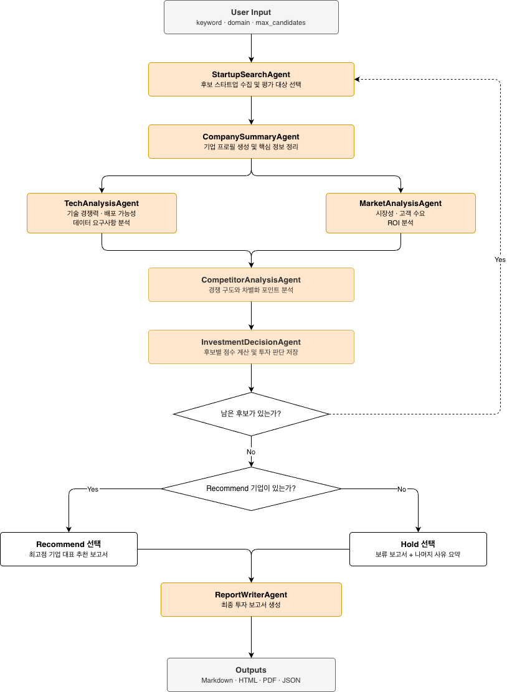
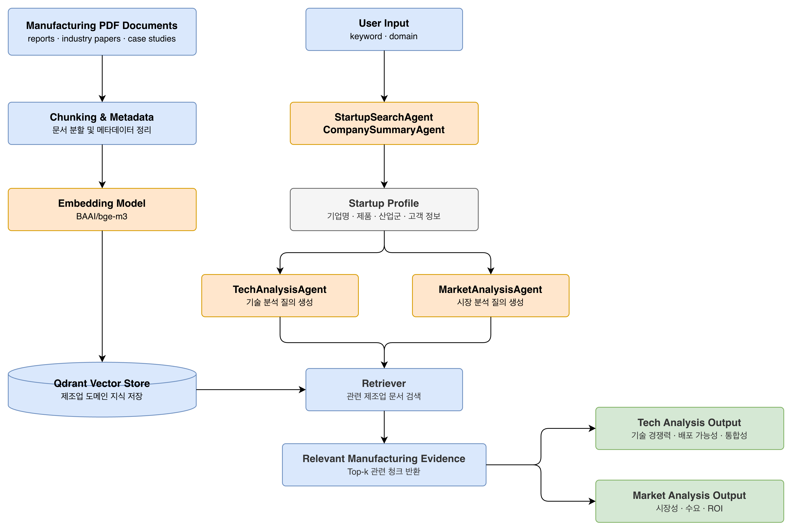

# Agentic RAG Manufacturing Investment Evaluator

제조업 AI 스타트업의 투자 적합성을 자동으로 평가하기 위한 LangGraph 기반 Agentic RAG 프로젝트입니다. 공개 웹 정보와 제조업 도메인 PDF 문서를 함께 활용해 스타트업 후보를 탐색하고, 기술성·시장성·경쟁 구도·리스크를 분석한 뒤 최종 투자 검토 보고서를 생성합니다.

> 단순 기업 소개가 아니라, 실제 투자 검토 관점에서 여러 후보를 선별하는 과정을 거치고 우선 검토 대상을 도출하는 것을 목표로 합니다.


## Overview

제조업 AI 스타트업은 기술 설명만으로 투자 가치를 판단하기 어렵습니다. 같은 AI 기술이라도 제조 현장에서는 데이터 확보 가능성, 설비 연동 난이도, 배포 방식, ROI, 산업별 적용성에 따라 사업성이 크게 달라집니다.

이 프로젝트는 이러한 문제를 해결하기 위해 **웹 검색 + RAG + 다중 에이전트 오케스트레이션** 구조를 사용합니다.

| 항목 | 내용 |
|-----|-----|
| 목표 | 제조업 AI 스타트업의 투자 적합성 자동 평가 |
| 방식 | LangGraph 기반 Multi-Agent + Agentic RAG |
| 입력 | 검색 키워드, 도메인, 최대 후보 수 |
| 출력 | 투자 보고서 (`.md`, `.html`, `.pdf`) 및 실행 상태 (`.json`) |
| 핵심 판단 요소 | 기술 경쟁력, 시장성, 경쟁 구도, 현장 적용성, 리스크 |


## Key Features

- 웹 검색 기반 스타트업 후보 발굴
- 기업 프로필 자동 요약
- 제조업 PDF 코퍼스 기반 RAG 분석
- 기술성 / 시장성 분리 평가
- 경쟁사 및 대체 솔루션 비교
- 점수 기반 투자 판단 생성
- 추천 실패 시 다음 후보로 넘어가는 반복 평가 구조
- Markdown / HTML / PDF 보고서 생성
- 참고 출처 자동 정리


## Architecture

본 프로젝트는 LangGraph 상에서 여러 에이전트가 역할을 나누어 실행되는 구조입니다.




### Workflow Summary

1. `StartupSearchAgent`가 입력 키워드를 바탕으로 제조업 AI 스타트업 후보 목록을 수집합니다.  
2. 시스템은 현재 평가할 후보를 하나씩 선택하고 `CompanySummaryAgent`가 기업 프로필을 생성합니다.  
3. `TechAnalysisAgent`와 `MarketAnalysisAgent`가 각각 기술성과 시장성을 분석합니다.  
4. `CompetitorAnalysisAgent`가 경쟁 구도와 차별화 포인트를 정리합니다.  
5. `InvestmentDecisionAgent`가 각 후보의 점수와 투자 판단을 생성하고 결과를 누적 저장합니다.  
6. 남은 후보가 있으면 다음 후보에 대해 동일한 평가 과정을 반복합니다.  
7. 모든 후보 평가가 끝난 뒤 `recommend`가 1개 이상이면 가장 높은 점수의 추천 기업을 기준으로 최종 보고서를 작성합니다.  
8. `recommend`가 없으면 가장 높은 점수의 보류 기업을 대표 사례로 선택하고, 나머지 기업들의 보류 사유를 함께 요약한 보류 보고서를 작성합니다.  
9. 최종 결과는 Markdown, HTML, PDF, JSON 형식으로 저장됩니다.

---

## RAG Pipeline

본 프로젝트의 RAG는 제조업 AI 스타트업 자체 정보를 직접 저장하는 용도보다, 제조업 현장 적용성, 시장 맥락, 도입 리스크를 보강하는 **도메인 지식 검색 레이어**로 사용됩니다.



### Pipeline Flow
1. 제조업 관련 PDF 문서를 `data/rag_docs/`에 저장합니다.  
2. 문서 메타데이터를 `manifest.json`으로 관리합니다.  
3. 문서를 청크 단위로 분할하고 임베딩을 생성합니다.  
4. 생성된 임베딩을 Qdrant 벡터스토어에 저장합니다.  
5. 분석 에이전트가 질문을 생성하면 관련 청크를 벡터 검색으로 검색합니다.  
6. 검색된 문서를 근거로 기술 분석 및 시장 분석을 수행합니다.  
7. 최종 투자 판단 에이전트는 각 분석 결과와 evidence를 종합해 점수와 판단을 생성합니다.

---

## RAG vs Web Search

| 구분 | 역할 |
|-----|-----|
| Web Search | 스타트업의 최신 기업 정보, 제품, 고객 사례, 웹사이트 정보 수집 |
| RAG | 제조업 도메인 지식, 산업 리포트, 도입 장벽, ROI, 기술 적용성 근거 보강 |

---

## RAG Data Sources

| Document ID | 문서 유형 | 내용 | 활용 목적 | 문서명 | 발행처 |
|--------------|------------|------|-----------|-------|-------|
| DOC 1 | 제조업 AI 산업 보고서 | 제조업 AI 적용 분야 및 기술 트렌드 | 제조업 AI 기술 이해 | Artificial Intelligence, its diffusion and uses in manufacturing | OECD |
| DOC 2 | 기술 표준 / 프레임워크 문서 | AI 기술 성숙도 및 도입 장벽 분석 | 기술 적용성 분석 | Artificial Intelligence: Key Consideration and Effective Implementation Strategies | NIST MEP National Network |
| DOC 3 | 제조업 디지털 전환 보고서 | AI, 데이터, 경쟁 구조, 생태계와 진입장벽, 서비스 전환 비용 등 분석 | 경쟁 환경 및 시장 진입장벽 분석 | Artificial intelligence, data and competition | OECD |
| DOC 4 | 산업 AI 시장 리포트 | 글로벌 제조 AI 시장 규모 및 투자 트렌드 | 시장성 평가 | AI in Manufacturing: Market Analysis and Opportunities / THE FUTURE OF INDUSTRIAL AI IN MANUFACTURING / Unlocking Value from Artificial Intelligence in Manufacturing | Abdelaal Mohamed / Manufacturing Leadership Council / World Economic Forum |


## Agent Roles

| Agent | 역할 | 반영되는 평가 항목 |
|------|------|----------------|
| StartupSearchAgent | 제조업 AI 스타트업 후보 탐색 및 후보 리스트 생성 | 문제 적합성 |
| CompanySummaryAgent | 회사 개요, 제품, 고객, 산업군 요약 | 팀 역량 |
| TechAnalysisAgent | 기술 경쟁력, 데이터 요구사항, 배포 가능성 분석 | 기술 경쟁력, 현장 적용 가능성 |
| MarketAnalysisAgent | 시장 기회, 수요, ROI, 상용화 가능성 분석 | 시장성 |
| CompetitorAnalysisAgent | 경쟁사, 대체재, 차별화 포인트 분석 | 경쟁 우위 |
| InvestmentDecisionAgent | 점수 계산 및 최종 투자 판단 생성 | 전체 점수 계산 및 최종 투자 판단 |
| ReportWriterAgent | 최종 투자 검토 보고서 작성 | 투자 평가 결과 기반 보고서 작성 |


## Decision Framework

본 시스템은 제조업 AI 스타트업을 아래 **9개 기준**으로 평가합니다. 모든 평가는 제공된 evidence를 기반으로 수행되며, 정보가 부족한 경우에는 추측하지 않고 보수적으로 점수화합니다.

| Criterion | Weight | 설명 |
|-----------|-------|------|
| Problem Fit | 15% | 해당 스타트업이 해결하려는 문제가 실제 제조 현장의 핵심 문제(pain point)를 해결하는가 |
| Market Opportunity | 15% | 제조업 AI 시장의 성장성과 고객 수요가 충분한가 |
| Technology | 15% | 기술이 독창적이며 경쟁사 대비 차별성이 있는가 |
| Deployability | 15% | 공장 환경에서 실제로 도입 및 운영 가능한 기술인가 |
| Data Availability | 5% | AI 모델 운영에 필요한 데이터를 안정적으로 확보할 수 있는 구조인가 |
| Integration | 10% | 기존 MES, ERP, 생산 설비 시스템 등과 연동 가능한가 |
| Scalability | 10% | PoC 이후 여러 공장이나 생산 라인으로 확장 가능한가 |
| Team Capability | 5% | 창업자 및 핵심 팀이 해당 산업과 기술에 대한 전문성을 갖추었는가 |
| Risk Assessment | 10% | 기술, 시장, 운영 측면에서 주요 리스크가 존재하는가 |


## Scoring Principles

- 각 항목은 **1~5점 raw score**로 평가합니다.
- 가중 점수와 총점은 애플리케이션 코드에서 계산합니다.
- reason은 반드시 evidence 기반으로 작성합니다.
- 정보가 부족할수록 점수는 보수적으로 부여됩니다.
- 근거 없는 낙관적 판단은 지양합니다.


## Final Decision Types

| Decision | 의미 | 총점 |
|----------|------|------|
| recommend | 기술 적용성과 시장 타당성이 비교적 명확해 우선 검토 대상으로 추천 | 80점 이상 |
| conditional_review | 잠재력은 있으나 데이터, 통합, 고객 검증 등 추가 확인이 필요 | 65 ~ 79점 |
| hold | 공개 정보 기준 근거가 부족하거나 경쟁 우위와 시장성이 약함 | 64점 이하 |


## Tech Stack

| Category | Details |
|----------|---------|
| Language | Python 3.11 |
| Framework | LangGraph, LangChain |
| LLM | OpenAI GPT-4.1-mini |
| Search | Tavily |
| Vector DB | Qdrant |
| Embedding | BAAI/bge-m3 |
| PDF Processing | PyMuPDF |
| Report Export | Markdown, WeasyPrint, matplotlib, numpy |
| Package Manager | uv |

<details>
<summary><h3>임베딩 모델</h3></summary>

| 모델 | 주요 스펙 | 장점 | 단점 |
|------|-----------|------|------|
| BAAI / bge-m3 | 1024차원 임베딩 / 최대 8192 토큰 / 100개 이상 언어 지원 | 한국어·영어 다국어 성능 우수 / 긴 문서 처리 가능 / hybrid 검색 확장 가능 | 모델 크기가 커 메모리 사용량이 높음 / 임베딩 속도가 느림 |
</details>

## Project Structure

```text
.
├── app.py
├── build_index.py
├── docker-compose.yml
├── pyproject.toml
├── .env.example
├── README.md
├── data/
│   └── rag_docs/
│       ├── manifest.json
│       └── *.pdf
├── docs/
│   ├── orchestration.md
│   ├── rag_rules.md
│   ├── report_format.md
│   └── demo_scenarios.md
├── src/
│   ├── agents/
│   │   ├── startup_search.py
│   │   ├── company_summary.py
│   │   ├── tech_analysis.py
│   │   ├── market_analysis.py
│   │   ├── competitor_analysis.py
│   │   ├── investment_decision.py
│   │   └── report_writer.py
│   ├── rag/
│   │   ├── index_builder.py
│   │   └── retriever.py
│   ├── tools/
│   │   └── web_search.py
│   ├── utils/
│   ├── config.py
│   ├── graph.py
│   ├── prompts.py
│   ├── schemas.py
│   ├── scoring.py
│   └── state.py
└── outputs/
```

## Directory Guide

- `data/rag_docs/` : 제조업 관련 PDF 문서와 메타데이터를 저장하는 RAG 코퍼스  
- `docs/` : 오케스트레이션, 리포트 포맷, 데모 시나리오 등 상세 문서  
- `src/agents/` : 단계별 평가 에이전트 구현  
- `src/rag/` : 벡터 인덱스 생성 및 검색 로직  
- `src/tools/` : 외부 웹 검색 도구  
- `outputs/` : 최종 보고서와 상태 파일 저장 경로  

<details>
<summary><h2>Setup</h2></summary>

### Requirements

- Python 3.11
- uv
- Docker / Docker Compose
- OpenAI API Key
- Tavily API Key


### 1. Install Dependencies

```bash
uv python install 3.11
uv venv --python 3.11
uv sync
cp .env.example .env
docker compose up -d qdrant
```

### 2. Configure Environment Variables

`.env` 파일에 아래 값을 설정합니다.

```env
OPENAI_API_KEY=
OPENAI_MODEL=gpt-4.1-mini
TAVILY_API_KEY=

DOMAIN=manufacturing
INPUT_KEYWORD=manufacturing AI startup
MAX_CANDIDATES=5

EMBEDDING_MODEL_NAME=BAAI/bge-m3
CHUNK_SIZE=1200
CHUNK_OVERLAP=200
TOP_K_TECH=6
TOP_K_MARKET=6

QDRANT_URL=http://localhost:6333
QDRANT_API_KEY=
QDRANT_COLLECTION_NAME=manufacturing_startup_eval
```

### 3. Prepare RAG Documents

- PDF files: `data/rag_docs/*.pdf`
- Metadata: `data/rag_docs/manifest.json`

벡터 인덱스는 앱 실행 시 자동 생성되지 않으므로 먼저 인덱싱 작업을 수행해야 합니다.

```bash
uv run python build_index.py
```

### 4. Run the Application

```bash
uv run python app.py --keyword "manufacturing AI startup" --max-candidates 5
```

예시

```bash
uv run python app.py --keyword "manufacturing AI inspection startup" --max-candidates 5
```

```bash
uv run python app.py --keyword "industrial predictive maintenance AI startup" --max-candidates 5
```
</details>

## Outputs

| 파일 | 설명 | 산출물|
|-----|-----|-----|
| final_report_*.md | 최종 투자 검토 보고서 원본 | [docs/outputs/final_report_20260313_104944.md](docs/outputs/final_report_20260313_104944.md) |
| final_report_*.html | 브라우저 확인용 렌더링 결과 | [docs/outputs/final_report_20260313_104944.html](docs/outputs/final_report_20260313_104944.html) |
| final_report_*.pdf | 발표 및 공유용 문서 | [docs/outputs/final_report_20260313_104944.pdf](docs/outputs/final_report_20260313_104944.pdf) |
| final_state_*.json | 그래프 실행 상태 및 누적 평가 결과 | [docs/outputs/final_state_20260313_104944.json](docs/outputs/final_state_20260313_104944.json) |


## Limitations

- 공개 웹 정보의 품질에 따라 기업 프로필 정확도가 달라질 수 있습니다.
- RAG 코퍼스가 제조업 일반 문서 중심일 경우 특정 스타트업 직접 정보는 제한적일 수 있습니다.
- 팀 역량, 재무 정보, 고객 계약 상태 등 일부 핵심 투자 요소는 공개 정보만으로 충분히 평가하기 어렵습니다.
- 본 시스템은 투자 보조 도구이며 실제 투자 의사결정을 대체하지 않습니다.


## Future Work

- 팀 및 재무 분석 에이전트 추가
- 산업 세부 분야별 평가 기준 고도화
- reference grounding 및 citation 체계 개선
- UI / 대시보드 구축
- 다중 기업 비교 기능 확장


## Investment Report Highlights

- 여러 제조업 AI 스타트업 후보를 끝까지 비교 평가한 뒤, 최종적으로 **추천 우선 대상 1개** 또는 **대표 보류 후보**를 선정하도록 설계했습니다.
- 점수는 **문제 적합성, 시장성, 기술, 현장 적용성, 데이터, 통합, 확장성, 팀 역량, 리스크**의 9개 기준을 가중 합산해 계산합니다.
- 정보가 부족한 항목은 낙관적으로 추정하지 않고 **보수적으로 채점**하며, 보고서에 항목별 근거와 한계를 함께 제시합니다.
- 추천 기업이 없더라도 보류 사유와 핵심 취약점을 정리해 **설명 가능한 투자 검토 보고서**를 생성합니다.
- 최종 보고서는 서술형 투자 메모와 별도 레퍼런스 섹션으로 구성해 **가독성과 검증 가능성**을 함께 확보했습니다.

## Lessons Learned

### 프롬프트 제약은 구체적인 나쁜 예시와 함께 써야 효과가 있다 (권세빈)
"인라인 출처를 쓰지 마세요"만으로는 부족합니다. (What Does Allie Do? | PromptLoop) 같은 구체적인 패턴을 프롬프트에 명시해야 LLM이 실제로 피합니다. 또한 검색 기반 에이전트는 동일 도메인을 여러 번 참조하기 때문에 레퍼런스는 URL 기준 dedupe와 도메인당 개수 제한으로 반드시 후처리가 필요합니다. 함수 시그니처를 변경할 때는 호출부도 함께 확인해야 하며, 이는 팀 협업에서 특히 중요합니다.
### State와 스키마 설계는 처음부터 제대로 정해야 한다 (김현문)
초기에 evidence를 단순 string으로 수집했을 때의 한계를 보완하기 위해 EvidenceItem 클래스를 추가하고 rubric 기반 채점 기준을 적용하면서 결과 품질이 향상됐습니다. 나중에 고치기 어렵기 때문에 프로젝트 초반 설계가 중요합니다. 또한 각자의 역할을 문서로 명확히 나누고 에이전트가 서로의 영역을 침범하지 않도록 프롬프트를 작성하면, 충돌 없이 생산성이 올라가는 협업 환경을 만들 수 있습니다.
### RAG는 검색 성능보다 목적에 맞는 근거 선별 설계가 핵심이다 (박동민)
semantic similarity만으로는 특정 문서에 편중되거나 유사 문단이 반복되는 문제가 생깁니다. 문서마다 tech, market, manufacturing 태그를 부여하고 에이전트 역할별로 다르게 가져오도록 구성하면 분석 품질이 달라집니다. RAG에서는 검색 성능보다, 분석 목적에 맞게 근거를 구분하고 선별하는 설계가 더 중요합니다.
### 멀티에이전트 시스템에서 중요한 것은 agent 수가 아니라 상태 설계다 (이주원)
후보 스타트업 리스트, 현재 평가 대상, 누적 평가 이력, 최종 보고서 대상 기업을 명확히 분리하지 않으면 반복 평가 구조가 쉽게 꼬입니다. 실제 투자 검토는 단일 기업 평가가 아니라 여러 후보를 선별하는 과정에 가깝기 때문에, 추천 기업이 없을 때도 다음 후보를 계속 평가하고 최종적으로 대표 보류 기업과 보류 사유 요약을 생성하는 구조가 더 현실적인 워크플로우입니다.


## Contributors

| 이름 | 담당 역할 |
|-----|-----------|
| 이주원 | Orchestration, Startup Search |
| 박동민 | RAG Indexing, Retrieval |
| 권세빈 | Analysis Agents |
| 김현문 | Investment Decision, Report Writer |